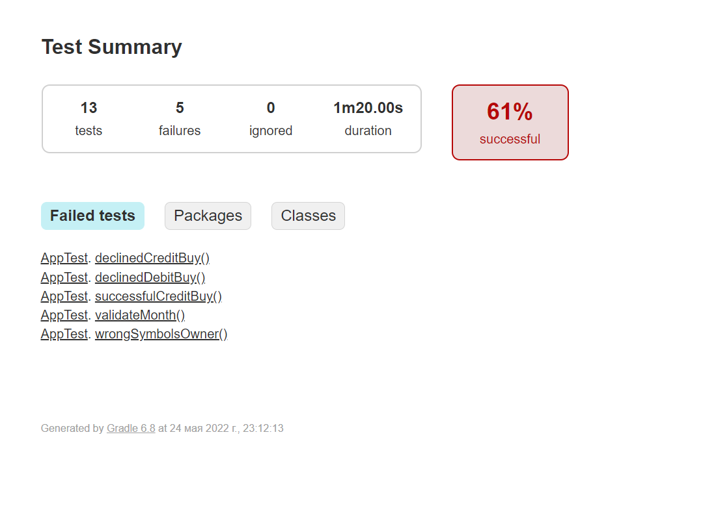

### Итоги проведенного тестирования

* Мною было проведено тестирование работы приложения покупки 
тура с помощью автоматизированных тестов. Был найдены баги в его 
  работе, о чем заведены 
[баг-репорты](https://github.com/NadezhdaZykova/Diplom-Test/issues).
* Всего было написано 13 тест-кейса.
* 61% тестов прошли (5/13 тестов прошли).
  
* Необходимо исправить все найденные недочеты и провести повторное тестирование.
* Можно добавить окно с подтверждением выбора после заполнения 
  формы и нажатия кнопки продолжить.